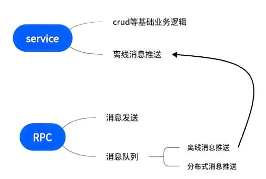

# IM聊天室系统

本IM聊天室项目采用微服务架构设计，分为Service层和RPC微服务层，实现了高性能、高可用的即时通讯系统。

## 系统架构

系统主要分为两个核心部分：

### 1. Service端

负责处理基础业务功能和数据操作：

- 用户管理（注册、登录、资料管理）
- 好友关系维护
- 群组管理
- 消息历史记录存储与查询
- 权限验证

### 2. RPC微服务端

专注于消息传输这一核心热点功能：

- 管理用户长连接
- 实时消息路由与分发
- 离线消息处理
- 消息状态跟踪
- 心跳维护

## 技术特点

### 分层设计优势

将系统拆分为Service端和RPC端的设计使得：

- **解耦核心功能**：将高频热点服务与基础服务分离
- **便于横向扩展**：可以根据负载情况独立扩展RPC节点
- **灵活的资源分配**：不同类型的服务可以部署在不同规格的服务器上
- **技术栈优化**：各层可以使用最适合其功能特点的技术实现

### 缓存策略

Service端采用旁路缓存策略：

- 优先从Redis读取数据，减少数据库查询
- 写操作同时更新缓存和数据库
- 定时缓存失效机制，保证数据一致性
- 热点数据预加载，提高响应速度

### 消息队列技术

RPC端利用消息队列解决分布式架构下的消息传递问题：

- 跨节点消息通过消息队列中转，解决直接发送问题
- 离线用户的消息暂存于队列，等用户上线后重新投递
- 消息持久化，确保系统故障恢复后消息不丢失
- 消息优先级排序，保证重要消息优先处理

### 高可用保障

- 服务注册与发现：实时感知节点状态变化
- 负载均衡：根据节点负载动态分配新连接
- 故障转移：节点故障时连接自动迁移
- 限流与熔断：保护系统在高峰期稳定运行

## 性能指标

经过测试，在中等配置服务器上（i7-13700H, 16GB RAM）：

- 单节点支持约1000 TPS的消息处理能力
- 可支持同时在线用户约8-10万
- 活跃聊天用户约3-4万
- 系统可横向扩展，理论上可支持百万级用户规模

## 部署与测试

### API文档

可通过导入Postman集合快速了解系统API：

[IM.postman_collection.json](config/IM.postman_collection.json)

grpc接口：

[chat.proto](chat.proto)

### 部署建议

- Service层建议部署在接近数据库的节点
- RPC层建议部署在网络性能良好的节点
- Redis集群建议采用主从结构提高可用性
- 消息队列建议配置持久化，防止数据丢失

### 扩展方向

- 支持更多消息类型（图片、语音、视频）
- 添加端到端加密功能
- 引入WebSocket以支持Web客户端
- 集成推送服务支持移动端通知

## 技术栈

- 后端：Go语言
- 数据库：MySQL + Redis
- 消息队列：redis
- 服务发现：Consul
- 负载均衡：nginx
- 微服务：grpc

---

通过以上架构设计和技术选型，本IM系统能够有效应对高并发场景，同时保持良好的扩展性和可维护性。
